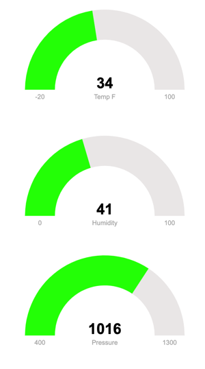

# pi-sense-monitor
A pi-sense monitor dashboard.  It provides temperature and humidity on the LED in addition to a dashboard and API endpoint with the pi-sense measurements.



## Setup
``` bash
sudo apt install sense-hat
sudo apt install python-pip
sudo apt install nginx
pip install flask
python app.py    # for the LED
python server.py # for the web and api
```

### Configure NGINX
```
cp nginx.conf /etc/nginx/sites-available/default
sudo systemctl restart nginx
```

### Enable auto-start on boot
Copy the pi-sense.service to /etc/systemd/system/ and start the sevice
```bash
sudo cp pi-sense-display.service /etc/systemd/system
sudo cp pi-sense-server.service /etc/systemd/system
sudo systemctl daemon-reload
sudo systemctl enable pi-sense-display.service
sudo systemctl enable pi-sense-server.service
sudo systemctl is-enabled pi-sense-display.service  #to verify is enabled
sudo systemctl is-enabled pi-sense-server.service  #to verify is enabled
```

## Testing HTML
```bash
cd public
python -m http.server 8080
```

## API Endpoint
```bash
curl localhost/api/v1.0/sensors
```
``` json
{"accelerometer":{"pitch":5.049203256666763,"roll":90.36030864357468,"yaw":256.3111919081707},"celcius":7,"compass":256.3127901724365,"fahrenheit":34,"gyroscope":{"pitch":5.049203256666763,"roll":90.36030864357468,"yaw":256.3111919081707},"humidity":40.812782287597656,"orientation_degrees":{"pitch":5.049457254326523,"roll":90.36035645489886,"yaw":256.3092453042573},"pressure":1016.48095703125}
```

## References
- https://kevalnagda.github.io/flask-app-with-wsgi-and-nginx
- https://raspberrytips.com/sense-hat-tutorial/
- https://pythonhosted.org/sense-hat/
- https://thepi.io/how-to-create-a-raspberry-pi-thermometer-using-the-sense-hat/
- https://www.jqueryscript.net/animation/Javascript-Animated-Gauges-Plugin-JustGage.html
- https://github.com/toorshia/justgage
- https://linuxhandbook.com/create-systemd-services/
- https://www.instructables.com/Make-your-HTML-Website-suitable-for-Mobile-Devices/
- https://www.mikulskibartosz.name/a-python-http-server-for-serving-static-content/